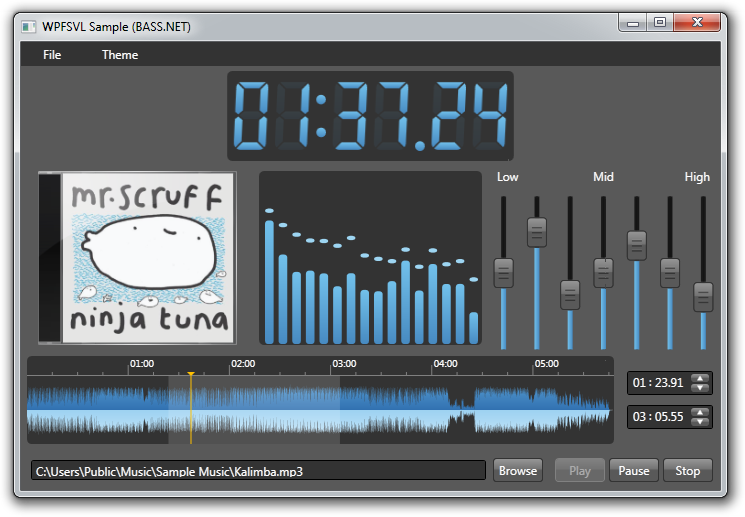
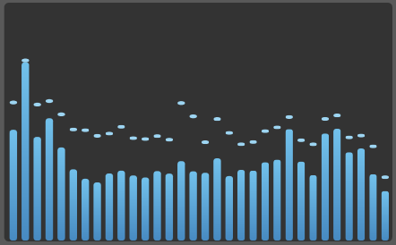
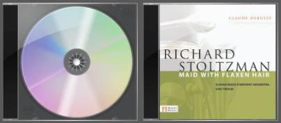
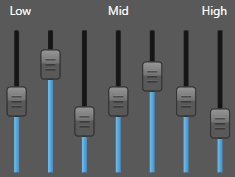
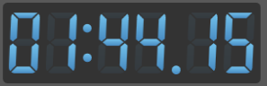
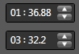
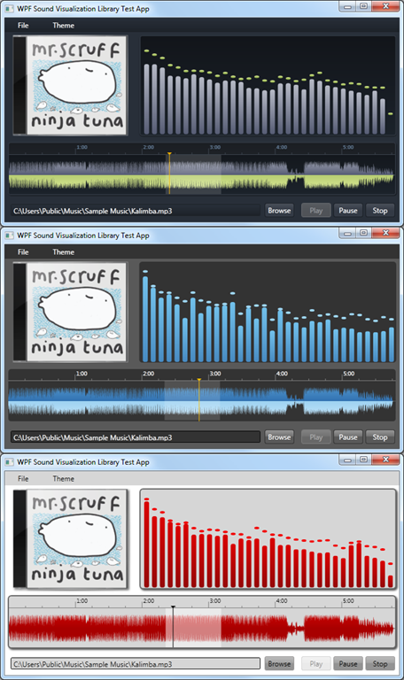

# Project Description

 

The WPF Sound Visualization Library is a collection of WPF Controls for graphically displaying data related to sound processing. Current controls include a Spectrum Analyzer, Waveform Timeline, and an Album Art Display Panel.

Most of the WPF Sound Visualization Library controls were created to power my other project, BPMinus. Check it out.

# Controls

## Spectrum Analyzer

The Spectrum Analyzer shows sound levels for a given section of the frequency spectrum. Some of the features include:

 - Fast-Rendering
 - Animated falling peaks
 - Support for any source of FFT Data
 - Ability to customize frequency ranges, vertical scaling modes, etc.
 - Custom style support on bar and peak elements
 - Much more…
 

## Stereo Waveform Timeline

The Waveform Timeline is a control that allows the user to view level data across the entire audio stream. Some of the features include:

BitmapCached rendering with the ability to automatically scale.
Ability to create a repeat region with a mouse drag.
Four distinct regions (timeline, waveform, progress, and repeat overlay) that are capable of being customized in the control template.
 

## Album Art Display

The album art display is just eye candy to display album art cover images inside a CD-jewel cases. It gives a sense of nostalgia to those of us who are old enough to have purchased music before online purchases dominated!

 

## Equalizer

The equalizer is a convenient collection of vertical sliders that allows you to edit banded frequency gain in a single place.

 

## Digital Clock

Many audio applications have a live clock display. This is a take on emulating a digital LED clock. It updates quickly and takes a standard timespan value!

 

## Time Editor

The time editor allows users to edit timespan values with individual fields for hours, minutes, and seconds.

 

### More Coming Soon!

 

# Support For Templates/Themes

Each of the Controls has support for custom control templates using the standard WPF “PART_” convention. Take a look at the demo application for examples of how different themes can be implemented.

# About Sound Libraries

All of the Controls are agnostic of any individual sound library and provide interfaces to get at the data they need. The source comes with one example that works with BASS and BASS.NET and another example that works with NAudio. But, you can use any library you want. See the documentation for more information on choosing a Sound Library.

For more information about the author, or to check out some of my other projects, visit my blog at http://inchoatethoughts.com
